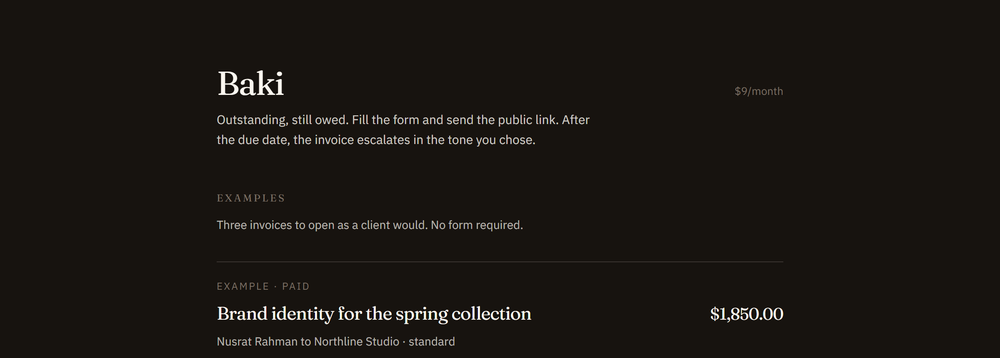
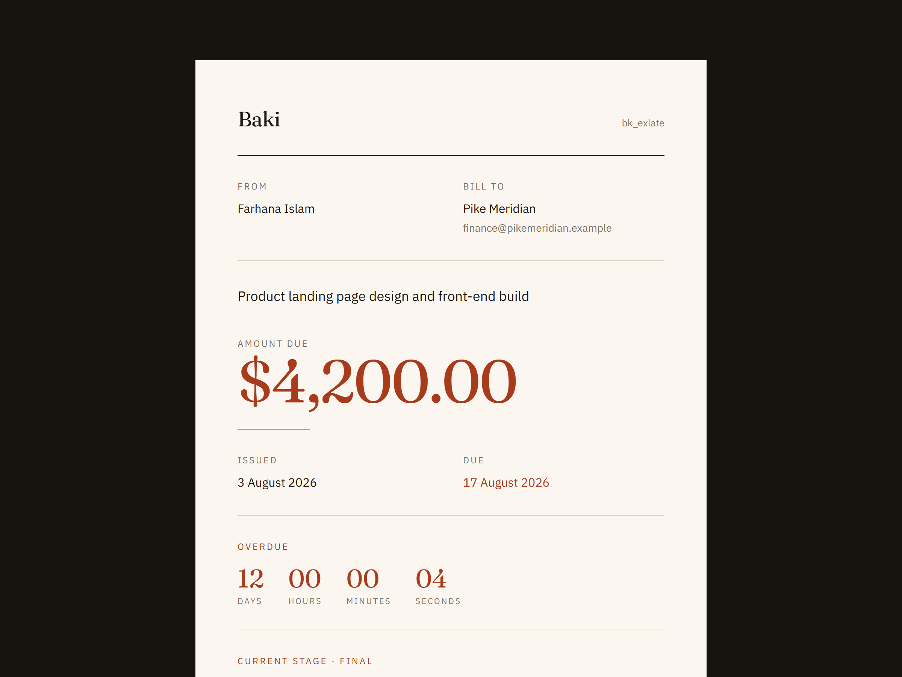
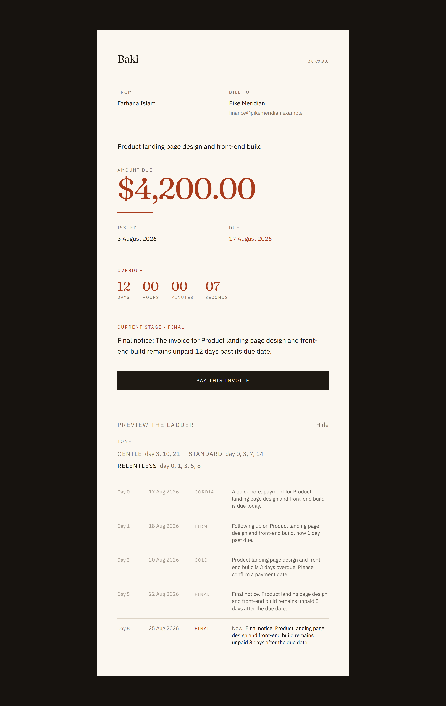

<div align="center">

# Baki

**Send an invoice link. Baki chases the client so you don't have to.**

[**Live app**](https://baki-chi.vercel.app) · [The escalation ladder](#the-escalation-ladder) · [Pricing](#pricing)

[](https://nextjs.org)
[](https://typescriptlang.org)
[](https://neon.tech)
[](https://baki-chi.vercel.app)

</div>

<br>



---

## The problem

*Baki* — বাকি — is Bangla for **outstanding, still owed**.

Bangladesh has one of the largest freelance workforces in the world, and most of that
work is billed to clients abroad. The invoice goes out. The due date passes. And then
the freelancer has to decide, alone, how impolite they are willing to be with someone
who might hire them again.

So the follow-up gets delayed. Then it gets softer than it should be. Then it gets
skipped, and the money arrives weeks late or not at all.

**This is not a writing problem. It is a scheduling problem that people solve badly
because it is uncomfortable.** Baki takes the discomfort out by deciding in advance.

## How it works

1. **Create an invoice.** Client, amount, what it was for, due date, and how hard you
   want to push. Twenty seconds.
2. **Send the link.** The client opens a clean invoice with a pay button. No account,
   no portal, no PDF attachment.
3. **Baki escalates.** Once the due date passes, the invoice page and the follow-up
   copy get progressively colder on the schedule you picked.

<table>
<tr>
<td width="50%" valign="top">

**The client's view**

A live overdue counter, the current stage of the ladder, and the exact wording that
goes with it. The page itself gets colder as the debt ages.

</td>
<td width="50%" valign="top">

**The whole ladder, upfront**

The freelancer sees every stage and its date before sending — so choosing a tone is a
decision made once, calmly, instead of four separate uncomfortable ones later.

</td>
</tr>
<tr>
<td width="50%"></td>
<td width="50%"></td>
</tr>
</table>

---

## The escalation ladder

Three tone tracks. The freelancer picks one when creating the invoice.

| Track | Follow-ups sent on |
|---|---|
| **Gentle** | day 3, 10, 21 |
| **Standard** | day 0, 3, 7, 14 |
| **Relentless** | day 0, 1, 3, 5, 8 |

Each follow-up escalates through four registers:

| Stage | Register |
|---|---|
| `CORDIAL` | A quick note: payment is due today. |
| `FIRM` | Following up, now *n* days past due. |
| `COLD` | This is *n* days overdue. Please confirm a payment date. |
| `FINAL` | Final notice. Unpaid *n* days after the due date. |

Stage is **derived from the due date and tone at render time**, never stored. The same
invoice always produces the same ladder, and there is no scheduler state to drift.

A model writes the copy when `OPENROUTER_API_KEY` is set. Without it, the templates
above are used and the product behaves identically. **The model is never load-bearing.**

## Pricing

**$9/month.** One freelancer, unlimited invoices.

The comparison is not other invoicing tools — it is the two weeks of float on a single
late payment, which for most freelancers is worth considerably more than nine dollars.

---

## Scope

Built in one sitting. Three things work completely, and everything else was cut on
purpose:

**Built:** invoice creation → public link · the client-facing invoice page with live
overdue state · the escalation ladder, previewable in full

**Deliberately not built:** authentication, a dashboard, multi-currency, recurring
invoices, PDF export, and real scheduled email delivery. The ladder is *shown* rather
than *sent*, because the mechanic is what needed proving, not the SMTP.

### On payments

Stripe accounts cannot currently be created from Bangladesh, which is the constraint
this project was built under. The pay flow is therefore **simulated with the real
shape** — a checkout-styled page, clearly labelled test mode, that marks the invoice
paid. Swapping in a live Stripe Payment Link is a one-line change in
[`lib/payment.ts`](lib/payment.ts). Nothing in the interface implies a live integration.

---

## Stack

| | |
|---|---|
| Framework | Next.js 16, App Router, server actions |
| Language | TypeScript |
| Database | Neon Postgres (serverless driver) |
| Styling | Tailwind with custom design tokens |
| Copy | OpenRouter → `google/gemini-2.5-flash`, optional |
| Hosting | Vercel |

The schema is created on first query and three example invoices are seeded
automatically, so a fresh clone with a valid `DATABASE_URL` is immediately explorable.

## Design

Warm ivory documents on a near-black ground. Fraunces for the wordmark and figures,
IBM Plex Sans for everything else, tabular numerals throughout.

**Colour is functional, never decorative:** green means paid, amber means due, rust
means overdue and deepening. The interface stays calm and the humour lives entirely in
the escalation copy.

## Running locally

```bash
git clone https://github.com/MRSHAKILS/Baki.git
cd Baki
npm install
cp .env.example .env.local   # add your Neon connection string
npm run dev
```

| Variable | Required | Notes |
|---|---|---|
| `DATABASE_URL` | Yes | Neon Postgres connection string |
| `OPENROUTER_API_KEY` | No | Without it, template copy is used |
| `OPENROUTER_MODEL` | No | Defaults to `google/gemini-2.5-flash` |

## License

MIT
