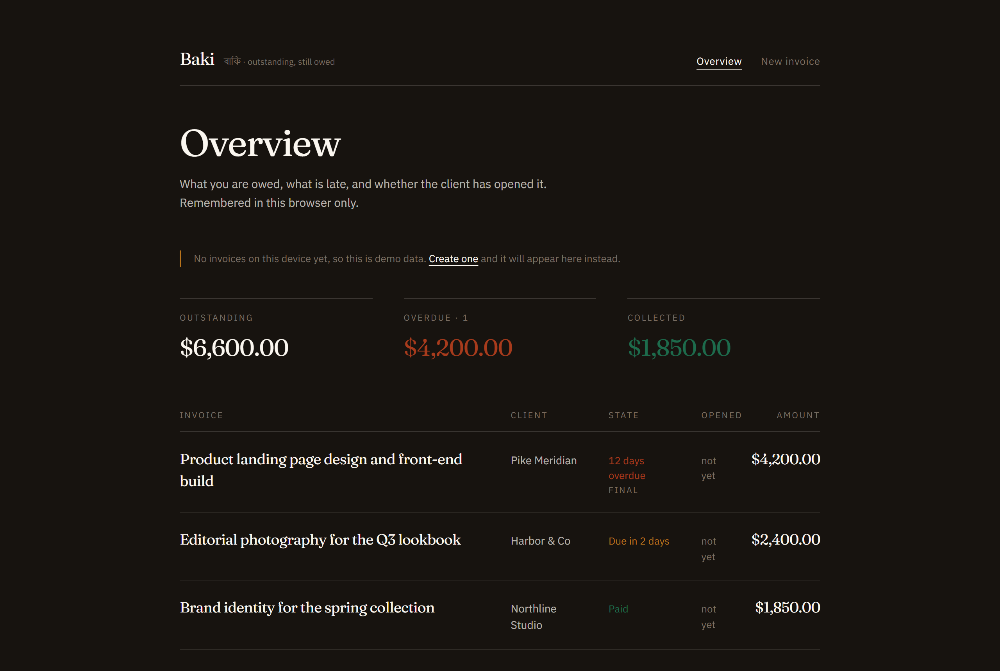
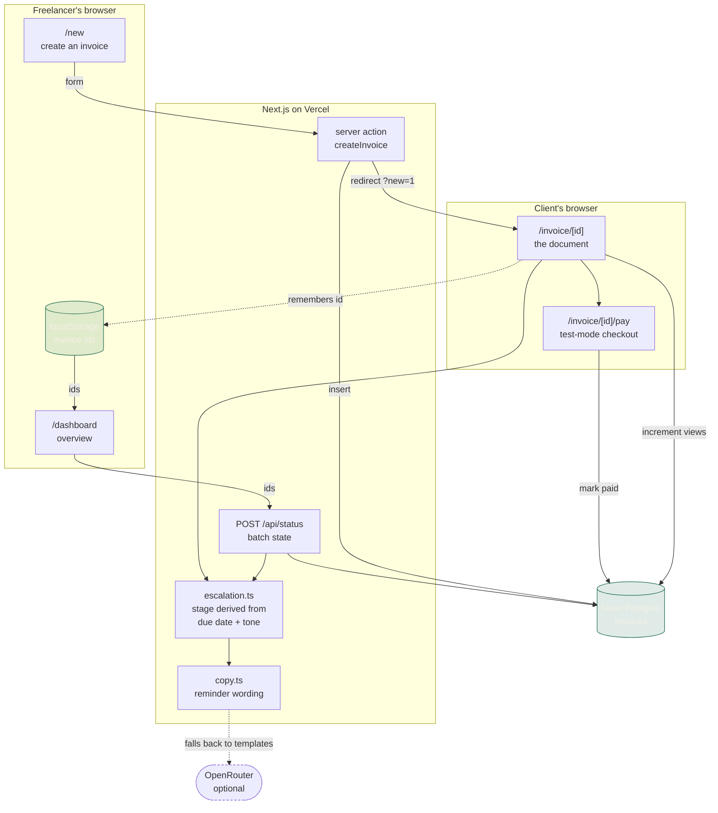

<div align="center">

# Baki

**Send an invoice link. Baki chases the client so you don't have to.**

[**Live app**](https://baki-chi.vercel.app) · [The escalation ladder](#the-escalation-ladder) · [Pricing](#pricing)

[](https://nextjs.org)
[](https://typescriptlang.org)
[](https://neon.tech)
[](https://baki-chi.vercel.app)

</div>

<br>


---

---

**An invoicing tool built around the part freelancers actually avoid: the follow-up.**

|  |  |
|---|---|
| **The tone is decided in advance** | You choose how hard to push when you send the invoice — four registers, three schedules. No deciding how impolite to be while you are annoyed. |
| **It writes each follow-up** | Ready to copy, or to open in WhatsApp or email, where these conversations actually happen. |
| **The client can answer back** | They can commit to a payment date. The ladder pauses until it passes, then resumes colder. |
| **You can see if they opened it** | The gap between unseen and ignored is the gap between waiting and chasing. |
| **And what actually reaches you** | Outstanding totals estimate what survives Payoneer and upay fees — in Bangladesh the invoice total is not the number that matters. |

## The problem

*Baki* — বাকি — is Bangla for **outstanding, still owed**.

Bangladesh has one of the largest freelance workforces in the world, and most of that
work is billed to clients abroad. The invoice goes out. The due date passes. And then
the freelancer has to decide, alone, how impolite they are willing to be with someone
who might hire them again.

So the follow-up gets delayed. Then it gets softer than it should be. Then it gets
skipped, and the money arrives weeks late or not at all.

**This is not a writing problem. It is a scheduling problem that people solve badly
because it is uncomfortable.** Baki takes the discomfort out by deciding in advance.

## How it works

1. **Create an invoice.** Client, amount, what it was for, due date, and how hard you
   want to push. Twenty seconds.
2. **Send the link.** The client opens a clean invoice with a pay button. No account,
   no portal, no PDF attachment.
3. **Baki escalates.** Once the due date passes, the invoice page and the follow-up
   copy get progressively colder on the schedule you picked.

<table>
<tr>
<td width="50%" valign="top">

**The overview**

What you are owed, what is late, and — the useful part — whether the client has actually
opened the invoice. Per device, no account.

</td>
<td width="50%" valign="top">

**The client's view**

A live overdue counter, the current stage of the ladder, and the wording that goes with
it. The document itself gets colder as the debt ages.

</td>
</tr>
<tr>
<td width="50%"></td>
<td width="50%"></td>
</tr>
</table>

---

## The client can answer back

Chasing is one-directional, which is why it fails. So the invoice gives the client a
second option beside paying: **commit to a date.**

```
Payment promised for 12 September. Reminders are paused until then.
```

While the promise holds, the ladder stops entirely — no follow-ups, no reddening
document. That silence is worth something to the client, which is what makes committing
attractive rather than ignorable.

If the date passes without payment, the ladder does not resume where it paused. It
resumes **one register colder**, with a floor of `COLD`, because a broken promise is worse
than an unanswered invoice. The overview marks it `Promise broken`.

## Baki writes it. You send it.

Every follow-up on the overview has a **Chase** action. It reveals the exact wording for
the stage that invoice has reached, addressed to that client, ready to **copy**, open in
**WhatsApp**, or open in **email**.

This is deliberate rather than a shortfall. Automated SMTP is the obvious build, but most
freelancers in this market chase clients on WhatsApp, from their own number, in their own
thread. Sending it for them would be less useful and less trusted. The hard part was never
delivery — it was deciding what to say and when. Baki does that part.

## What actually reaches you

Payoneer does not let users hold a balance in Bangladesh, and money typically arrives via
Payoneer and is withdrawn through a local partner such as upay. So the invoice total is
not the number that matters to the freelancer.

The overview shows an estimate of what survives the trip:

```
OUTSTANDING
$6,600.00
≈ $6,402.00 after Payoneer and upay fees (3%)
```

Published headline rates, not a quote — 2% receiving plus 1% withdrawal, defined in
[`lib/fees.ts`](lib/fees.ts). The client always sees the gross amount; this estimate is
for the freelancer alone.

## The escalation ladder

Three tone tracks. The freelancer picks one when creating the invoice.

| Track | Follow-ups sent on |
|---|---|
| **Gentle** | day 3, 10, 21 |
| **Standard** | day 0, 3, 7, 14 |
| **Relentless** | day 0, 1, 3, 5, 8 |

Each follow-up escalates through four registers:

| Stage | Register |
|---|---|
| `CORDIAL` | A quick note: payment is due today. |
| `FIRM` | Following up, now *n* days past due. |
| `COLD` | This is *n* days overdue. Please confirm a payment date. |
| `FINAL` | Final notice. Unpaid *n* days after the due date. |

Stage is **derived from the due date and tone at render time**, never stored. The same
invoice always produces the same ladder, and there is no scheduler state to drift.

A model writes the copy when `OPENROUTER_API_KEY` is set. Without it, the templates
above are used and the product behaves identically. **The model is never load-bearing.**

## Pages

| Route | |
|---|---|
| `/` | What the product is, the ladder, and three example invoices |
| `/new` | Create an invoice and get its link |
| `/dashboard` | What you are owed, what is late, what has been opened |
| `/invoice/[id]` | What the client sees |

## Pricing

**$9/month.** One freelancer, unlimited invoices.

The comparison is not other invoicing tools — it is the two weeks of float on a single
late payment, which for most freelancers is worth considerably more than nine dollars.

---

## Scope

Built in one sitting. Three things work completely, and everything else was cut on
purpose:

**Built:** invoice creation → public link · the client-facing invoice page with live
overdue state · the escalation ladder, previewable in full · an overview of what you are
owed · client-open tracking · one-click chase via copy, WhatsApp or email · a net-of-fees
estimate for Bangladeshi freelancers · a client-side promised date that pauses the ladder

**Deliberately not built:** authentication, multi-currency, recurring invoices, PDF
export, and real scheduled email delivery. The ladder is *shown* rather than *sent*,
because the mechanic is what needed proving, not the SMTP.

**On history without accounts.** Baki has no login, so the invoices you create are
remembered in `localStorage` on the device that created them and their live status is
fetched by id. Private to that browser, nothing shared between visitors, and the overview
falls back to demo data when the device is new.

### On payments

Stripe accounts cannot currently be created from Bangladesh, which is the constraint
this project was built under. The pay flow is therefore **simulated with the real
shape** — a checkout-styled page, clearly labelled test mode, that marks the invoice
paid. Swapping in a live Stripe Payment Link is a one-line change in
[`lib/payment.ts`](lib/payment.ts). Nothing in the interface implies a live integration.

---

## Architecture



**Two things this makes visible.** Escalation state is *derived*, never stored — the same
invoice always produces the same ladder, and there is no scheduler state to drift out of
sync. And the model sits on a dashed edge: `copy.ts` falls back to templates, so removing
OpenRouter changes the wording and nothing else.

## Stack

| | |
|---|---|
| Framework | Next.js 16, App Router, server actions |
| Language | TypeScript |
| Database | Neon Postgres (serverless driver) |
| Styling | Tailwind with custom design tokens |
| Copy | OpenRouter → `google/gemini-2.5-flash`, optional |
| Hosting | Vercel |

The schema is created on first query and three example invoices are seeded
automatically, so a fresh clone with a valid `DATABASE_URL` is immediately explorable.

## Design

Warm ivory documents on a near-black ground. Fraunces for the wordmark and figures,
IBM Plex Sans for everything else, tabular numerals throughout.

**Colour is functional, never decorative:** green means paid, amber means due, rust
means overdue and deepening. The interface stays calm and the humour lives entirely in
the escalation copy.

## Running locally

```bash
git clone https://github.com/MRSHAKILS/Baki.git
cd Baki
npm install
cp .env.example .env.local   # add your Neon connection string
npm run dev
```

| Variable | Required | Notes |
|---|---|---|
| `DATABASE_URL` | Yes | Neon Postgres connection string |
| `OPENROUTER_API_KEY` | No | Without it, template copy is used |
| `OPENROUTER_MODEL` | No | Defaults to `google/gemini-2.5-flash` |

## License

MIT
